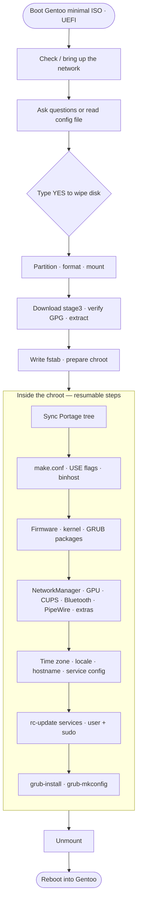

<div align="center">

# Gentoo Auto Installer

**One Bash script that takes a blank NVMe drive to a fully configured Gentoo Linux system —<br>OpenRC, ext4, NetworkManager + iwd, CUPS, Bluetooth, PipeWire, and a sudo user.**

<br>


</div>

---

## Table of contents

- [Features](#features)
- [Requirements](#requirements)
- [Quick start](#quick-start)
- [What you will be asked](#what-you-will-be-asked)
- [Unattended mode](#unattended-mode)
- [How it works](#how-it-works)
- [Kernel options](#kernel-options)
- [Networking in the live environment](#networking-in-the-live-environment)
- [Services enabled at boot](#services-enabled-at-boot)
- [After installation](#after-installation)
- [Troubleshooting and resuming](#troubleshooting-and-resuming)
- [Configuration reference](#configuration-reference)
- [Security notes](#security-notes)
- [Limitations and status](#limitations-and-status)
- [Contributing](#contributing)

---

## Features

| | Feature | Details |
|---|---|---|
| 💾 | **Automatic partitioning** | GPT on NVMe: 1 GiB EFI (FAT32), optional swap, ext4 root on the rest of the disk |
| 🐧 | **OpenRC stage3** | Latest `amd64-openrc` stage3, GPG-signature verified when the Gentoo release key is available |
| ⚡ | **Binary packages** | Optional official Gentoo binhost for a much faster install (`getuto` + signature checking) |
| 🧠 | **Your choice of kernel** | Prebuilt binary kernel, distribution kernel, genkernel, or manual `menuconfig` |
| 📶 | **NetworkManager + iwd** | Wi-Fi handled by iwd, configured automatically; your live-session Wi-Fi can be carried over |
| 🖨️ | **Printing (CUPS)** | Pick Gutenprint, HPLIP, brlaser, a virtual PDF printer and Avahi/mDNS discovery |
| 🔵 | **Bluetooth** | `bluez` with the adapter powered on automatically |
| 🔊 | **PipeWire** | PipeWire + WirePlumber + `pipewire-pulse` + ALSA, with Bluetooth audio support |
| 🎮 | **GPU drivers** | AMD (`amdgpu`/`radeonsi` + RADV Vulkan), Intel or nouveau — auto-detected via `lspci` |
| 🌏 | **Time zone & locale** | Defaults to `Asia/Jakarta`; Makassar, Jayapura or any zone is selectable |
| 👤 | **User + sudo** | Creates your user in `wheel`, `sudo` configured, optional `NOPASSWD`, optional root lock |
| 🔁 | **Everything starts at boot** | All chosen services are added to the right OpenRC runlevel automatically |
| 🛟 | **Resumable** | If a step fails inside the chroot, fix it and re-run — finished steps are skipped |
| 🤖 | **Unattended mode** | Drive the whole install from a config file with `-c config.conf -n -y` |

## Requirements

- An **x86_64 machine booted in UEFI mode** (Secure Boot **off** — GRUB is not signed)
- A **Gentoo Minimal Installation CD** (the official `install-amd64-minimal` ISO)
- An NVMe drive (any block device works, but NVMe is the default and auto-selected)
- An internet connection — the script can set up **Wi-Fi or wired** for you

> [!WARNING]
> The script **erases the whole target disk**. There is no dual-boot, LVM or LUKS support. You must type `YES` to confirm (or pass `-y`).

## Quick start

**1. Boot the Gentoo minimal ISO in UEFI mode** and open a root shell.

**2. Get the script onto the live system.** Either copy it from a USB stick, or download it once you have a network connection (run `net-setup` first if you need to get online):

```bash
wget https://github.com/nyxneverdie/gentoo-installer/blob/main/gentoo-installer.sh
```

**3. Run it:**

```bash
chmod +x gentoo-install.sh
./gentoo-install.sh
```

**4. Answer the questions.** Press <kbd>Enter</kbd> to accept the default shown in `[brackets]`. Confirm the disk wipe, then wait — the script does the rest and offers to reboot when it is finished.

<details>
<summary><b>Example session (abbreviated)</b></summary>

```text
[INFO] Checking internet connectivity ...
[WARN] No internet connection yet.

Choose a connection type
  1) Wi-Fi (scan & pick an SSID)  [default]
  2) Wired LAN (automatic DHCP)
  3) Gentoo's built-in wizard (net-setup)
  4) I connected manually — check again
  5) Cancel
Choice [1]: 1

Select a Wi-Fi network
  1) HomeNetwork   [signal 92%, psk]  [default]
  2) Neighbour     [signal 48%, psk]
  3) Enter SSID manually (hidden network)
  4) Rescan
Choice [1]: 1
Wi-Fi password for 'HomeNetwork': ********
[ OK ] Connected to 'HomeNetwork' and the internet is reachable.

=== Installation settings (Enter = default) ===

Select the target disk (ALL DATA WILL BE ERASED)
  1) /dev/nvme0n1 476.9G Samsung SSD 970 EVO  [default]
Choice [1]:
Swap size (e.g. 8G, 0 = no swap) [8G]:
...
Type 'YES' (uppercase) to continue: YES
```

</details>

## What you will be asked

Every question has a sensible default. The same values can be preset in a [config file](#unattended-mode).

| Group | Questions |
|---|---|
| **Network** | Wi-Fi / wired / `net-setup` (only if you are offline), SSID, password, save Wi-Fi to the new system |
| **Disk** | Target disk, swap size (`0` = none) |
| **System** | Mirror, hostname, time zone, locale, console keymap |
| **Kernel** | `gentoo-kernel-bin` / `gentoo-kernel` / genkernel / manual |
| **Packages** | Binary packages, `@world` update, firmware (`linux-firmware`, `sof-firmware`), GPU driver, Vulkan |
| **Services** | CUPS (+ drivers, PDF printer, Avahi), Bluetooth, PipeWire, elogind + polkit, sshd, cron + weekly TRIM, sysklogd, chrony |
| **Extras** | Any additional package atoms (default: `gentoolkit`, `vim`, `htop`, `bash-completion`) |
| **Account** | Username, password, passwordless sudo, lock root, root password |

## Unattended mode

Put your answers in a Bash-style file and pass `-n` (never prompt) and `-y` (skip the wipe confirmation):

```bash
./gentoo-install.sh -c config.conf -n -y
```

<details open>
<summary><b>Example <code>config.conf</code></b></summary>

```bash
DISK=/dev/nvme0n1
SWAP_SIZE=8G
HOST_NAME=gentoo
TIMEZONE=Asia/Jakarta
SYS_LOCALE=id_ID.UTF-8
KEYMAP=us

KERNEL_TYPE=bin            # bin | dist | genkernel | manual
USE_BINPKG=yes
GPU_DRIVER=amd             # amd | intel | nouveau | none

INSTALL_CUPS=yes
INSTALL_BLUETOOTH=yes
INSTALL_PIPEWIRE=yes

# Only used when the live system is not online yet
NET_MODE=wifi              # wifi | wired | netsetup
WIFI_SSID='MyWiFi'
WIFI_PASS='my-wifi-password'
SAVE_WIFI=yes

NEW_USER=alice
USER_PASSWORD='change-me'
ROOT_PASSWORD='change-me-too'
REBOOT_NOW=no
```

</details>

> [!NOTE]
> In `-n` mode the script **requires** `DISK`, `NEW_USER`, `USER_PASSWORD` and (unless `LOCK_ROOT=yes`) `ROOT_PASSWORD`. If the live system is offline it also needs `NET_MODE` (and `WIFI_SSID`/`WIFI_PASS` for Wi-Fi). Anything else falls back to its default.
> Keep config files that contain passwords private: `chmod 600 config.conf`.

## How it works



### Disk layout

| Partition | Size | Filesystem | Mount point | Notes |
|---|---|---|---|---|
| `nvme0n1p1` | 1 GiB | FAT32 (`EFI`) | `/efi` | GRUB EFI binary only |
| `nvme0n1p2` | your choice (default 8 GiB) | swap | — | skipped when swap size is `0` |
| `nvme0n1p3` | rest of disk | ext4 (`gentoo`) | `/` | kernels and initramfs live in `/boot` on this partition |

`fstab` uses UUIDs and `noatime` on the root filesystem.

### Defaults worth knowing

- `COMMON_FLAGS="-O2 -pipe -march=native"`
- `MAKEOPTS=-j<N>` where `N = min(CPU cores, RAM in GiB ÷ 2)`
- `ACCEPT_LICENSE="-* @FREE @BINARY-REDISTRIBUTABLE"`
- Locales `en_US.UTF-8` and `id_ID.UTF-8` are always generated; `LANG` defaults to `id_ID.UTF-8`, `LC_COLLATE=C.UTF-8`
- GRUB is installed as `Gentoo` in NVRAM; if no entry appears, the script also installs the removable fallback (`EFI/BOOT/BOOTX64.EFI`)

## Kernel options

| Option | Packages | Build time | Initramfs |
|---|---|---|---|
| `bin` *(default)* | `gentoo-kernel-bin` | seconds | dracut via `installkernel` |
| `dist` | `gentoo-kernel` | long | dracut via `installkernel` |
| `genkernel` | `gentoo-sources` + `genkernel` | long | genkernel |
| `manual` | `gentoo-sources` | long | dracut via `installkernel` |

With `manual`, the script seeds `.config` from the live ISO kernel (`/proc/config.gz`), runs `make olddefconfig`, then drops you into `make menuconfig` before building and installing (skipped in `-n` mode).

## Networking in the live environment

The minimal ISO ships **`wpa_supplicant`, `wpa_cli`, `dhcpcd` and `net-setup`** — not `iwctl` or `nmcli` — so that is exactly what the script uses.

| Capability | Supported |
|---|---|
| WPA2-PSK, WPA2/WPA3 transition | ✅ |
| WPA3-SAE | ✅ |
| Open networks | ✅ |
| Hidden SSIDs (manual entry) | ✅ |
| Several adapters (interface picker) | ✅ |
| Wired DHCP | ✅ |
| WPA-Enterprise (802.1X), WEP | ❌ — use another network or `net-setup` |

Networks are scanned with `wpa_cli`, listed strongest-first with signal strength and security type, and you get up to three attempts. When you opt to **save the Wi-Fi network**, a NetworkManager keyfile (`0600`) is written to the new system so it connects on first boot.

## Services enabled at boot

| Service | Runlevel | When |
|---|---|---|
| `elogind` | `boot` | elogind + polkit selected |
| `dbus` | `default` | always |
| `iwd` | `default` | always |
| `NetworkManager` | `default` | always (iwd backend, `rc_use="iwd"`) |
| `cupsd` | `default` | CUPS selected |
| `avahi-daemon` | `default` | CUPS + Avahi selected |
| `bluetooth` | `default` | Bluetooth selected |
| `alsasound` | `boot` | PipeWire selected |
| `sshd` | `default` | SSH selected |
| `cronie` | `default` | cron selected (also installs a weekly `fstrim` job) |
| `sysklogd` | `default` | logger selected |
| `chronyd` | `default` | chrony selected |

> [!NOTE]
> On OpenRC, PipeWire runs **per user session** (there is no system-wide unit). The script installs an XDG autostart entry for `gentoo-pipewire-launcher`, so audio comes up automatically in desktop sessions. On a plain TTY, run `gentoo-pipewire-launcher &`.

## After installation

```bash
# Wi-Fi
nmtui                                  # or: nmcli device wifi connect <SSID> --ask

# Bluetooth
bluetoothctl                           # power on · scan on · pair · connect

# Printing — open the CUPS web UI (log in as a user in the lpadmin group)
xdg-open http://localhost:631

# Audio
wpctl status

# Keep the system up to date
sudo emerge --sync && sudo emerge -avuDN @world
```

Your user belongs to `wheel` (sudo) plus `users`, `audio`, `video`, `usb`, `input`, `plugdev`, `lp`, `lpadmin`, `bluetooth` and `cdrom` — each only if the group exists on the system.

> [!TIP]
> This installs a **base system with all hardware services ready** — it does not install a desktop environment or window manager. Add your favourite (KDE Plasma, GNOME, Sway, …) afterwards with `emerge`.

## Troubleshooting and resuming

<details>
<summary><b>The install failed inside the chroot</b></summary>

The script prints the exact resume command. It looks like this:

```bash
chroot /mnt/gentoo /usr/bin/env -i HOME=/root TERM=$TERM \
    /bin/bash /root/gentoo-install.sh --stage chroot
```

Completed steps are recorded in `/root/.gentoo-install-state/` inside the new system and are skipped on re-run. To repeat one step, delete its marker file (for example `s_kernel`) and run the command again. **Do not re-run the whole script** — it would re-partition the disk.

</details>

<details>
<summary><b>"Not booted in UEFI mode"</b></summary>

Boot the ISO through the firmware's UEFI entry (not "Legacy"/"CSM"). Check with `ls /sys/firmware/efi` — the directory must exist.

</details>

<details>
<summary><b>No Wi-Fi networks listed</b></summary>

Choose **Rescan**, enter the SSID manually, or fall back to the `net-setup` wizard. Make sure the adapter is not hard-blocked (`rfkill list`) and that its firmware is available on the ISO.

</details>

<details>
<summary><b>The machine does not boot after install</b></summary>

Open the firmware boot menu and pick **Gentoo** or the generic UEFI entry (the removable fallback). Also confirm Secure Boot is disabled.

</details>

<details>
<summary><b>Black screen on an AMD GPU</b></summary>

`amdgpu` needs `linux-firmware`. The script forces it on for AMD, but if you built a manual kernel make sure `CONFIG_DRM_AMDGPU` is enabled and the firmware is available to the kernel or initramfs.

</details>

<details>
<summary><b>Mesa takes very long to build</b></summary>

Setting `VIDEO_CARDS` means Mesa (with LLVM) often cannot be taken from the binhost and is compiled locally. Keep `USE_BINPKG=yes`, expect a long compile on slower CPUs, or choose `GPU_DRIVER=none` if you do not need graphics yet.

</details>

## Configuration reference

<details>
<summary><b>All variables</b> (click to expand)</summary>

| Variable | Default | Description |
|---|---|---|
| `DISK` | first NVMe | Target block device (**required** with `-n`) |
| `SWAP_SIZE` | `8G` | Swap partition size; `0` disables swap |
| `MIRROR` | `https://distfiles.gentoo.org` | Gentoo mirror for stage3 and binhost |
| `HOST_NAME` | `gentoo` | System hostname |
| `TIMEZONE` | `Asia/Jakarta` | Any zone under `/usr/share/zoneinfo` |
| `SYS_LOCALE` | `id_ID.UTF-8` | Default `LANG` (`en_US.UTF-8` and `id_ID.UTF-8` are always generated) |
| `KEYMAP` | `us` | Console keymap |
| `KERNEL_TYPE` | `bin` | `bin`, `dist`, `genkernel` or `manual` |
| `USE_BINPKG` | `yes` | Use the official Gentoo binary package host |
| `UPDATE_WORLD` | `no` | Run `emerge -uDN @world` after syncing |
| `INSTALL_FIRMWARE` | `yes` | `linux-firmware` (+ `intel-microcode` on Intel CPUs); forced on for AMD GPUs |
| `INSTALL_SOF` | `yes` | `sof-firmware` for modern Intel audio |
| `GPU_DRIVER` | auto-detected | `amd`, `intel`, `nouveau` or `none` |
| `INSTALL_VULKAN` | `yes` | Install `vulkan-loader` |
| `INSTALL_CUPS` | `yes` | CUPS print server |
| `CUPS_GUTENPRINT` | `yes` | Gutenprint drivers |
| `CUPS_HPLIP` | `no` | HPLIP drivers (built without Qt/scanner support) |
| `CUPS_BRLASER` | `no` | Brother laser driver |
| `CUPS_PDF` | `yes` | Virtual PDF printer |
| `CUPS_AVAHI` | `yes` | Avahi / mDNS discovery |
| `INSTALL_BLUETOOTH` | `yes` | `bluez` |
| `INSTALL_PIPEWIRE` | `yes` | PipeWire, WirePlumber, ALSA utilities |
| `INSTALL_ELOGIND` | `yes` | `elogind` + `polkit` |
| `INSTALL_SSHD` | `no` | Enable `sshd` |
| `INSTALL_CRON` | `yes` | `cronie` |
| `ENABLE_FSTRIM` | `yes` | Weekly `fstrim` (implies cron) |
| `INSTALL_LOGGER` | `yes` | `sysklogd` |
| `INSTALL_CHRONY` | `yes` | `chrony` NTP client |
| `EXTRA_PKGS` | `gentoolkit vim htop bash-completion` | Space-separated package atoms; `-` for none |
| `NEW_USER` | — | Username (**required** with `-n`) |
| `USER_PASSWORD` | — | Password (**required** with `-n`) |
| `SUDO_NOPASSWD` | `no` | Passwordless sudo for `wheel` |
| `LOCK_ROOT` | `no` | Lock the root account (sudo only) |
| `ROOT_PASSWORD` | — | Required unless `LOCK_ROOT=yes` |
| `NET_MODE` | prompt | `wifi`, `wired` or `netsetup` — used only when offline |
| `WIFI_SSID` / `WIFI_PASS` | — | Preset Wi-Fi credentials |
| `WIFI_SECURITY` | `psk` | `psk` or `sae` for preset credentials |
| `WIFI_HIDDEN` | `no` | Mark the preset network as hidden |
| `SAVE_WIFI` | `yes` | Store the Wi-Fi profile on the new system |
| `NET_RECONFIGURE` | `no` | Offer to switch network even when already online |
| `REBOOT_NOW` | `yes` (`no` with `-n`) | Reboot when finished |

**Command-line options:** `-c, --config FILE` · `-n, --non-interactive` · `-y, --yes` · `-h, --help`

</details>

## Security notes

- Passwords are hashed with SHA-512 (`openssl passwd -6`) on the live system and handed to the chroot through a `0600` environment file that is deleted when the install finishes. Plain-text passwords are never written to the new system.
- A saved Wi-Fi profile does contain the passphrase in plain text — that is how NetworkManager keyfiles work — but is stored `0600` and owned by root.
- The stage3 tarball signature is verified when `gpg` and the Gentoo release key are present on the ISO; otherwise a warning is printed and the check is skipped.
- Binary packages are fetched from the official binhost with signature verification enabled (`binpkg-request-signature`).
- `NOPASSWD` sudo and locking root are opt-in; defaults are the conservative choice.

## Limitations and status

- **amd64 + UEFI + GRUB + ext4 only.** The target disk is fully wiped; no dual-boot, LVM, LUKS or Btrfs.
- No desktop environment, display manager or window manager is installed.
- No WPA-Enterprise or WEP support in the live-environment Wi-Fi helper.
- Package and USE flag names follow current Gentoo conventions, but Gentoo moves fast — if something fails, the resumable chroot stage lets you fix it and continue.

> [!IMPORTANT]
> The script has been syntax-checked (`bash -n`) and its helper functions (prompt handling, Wi-Fi scan parsing, `wpa_supplicant` config generation) have been unit-tested, but a complete end-to-end install has **not yet been validated on real hardware**. Please try it in a **virtual machine with a virtual NVMe disk** first, and open an issue with the output if anything misbehaves.

## Contributing

Issues and pull requests are welcome — especially:

- reports from real-hardware runs (CPU/GPU/Wi-Fi combinations),
- fixes for renamed packages or USE flags,
- support for additional bootloaders, filesystems or encryption.

Before submitting a change, please run:

```bash
bash -n gentoo-install.sh
shellcheck gentoo-install.sh   # if available
```

## Disclaimer

This software is provided **as is**, without warranty of any kind. It irreversibly erases a disk. Back up anything you care about and double-check the target device before confirming.
